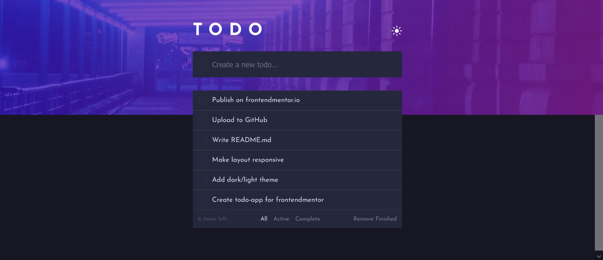
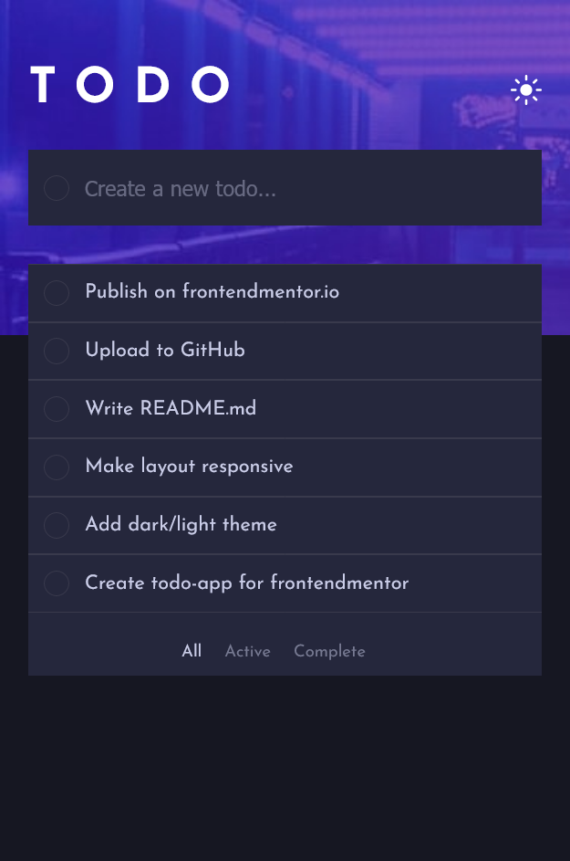

# Frontend Mentor - Todo app solution

This is a solution to the [Todo app challenge on Frontend Mentor](https://www.frontendmentor.io/challenges/todo-app-Su1_KokOW).

## Table of contents

- [Overview](#overview)
  - [The challenge](#the-challenge)
  - [Screenshot](#screenshot)
  - [Built with](#built-with)
- [Author](#author)
- [Acknowledgments](#acknowledgments)

## Overview

### The challenge

Users should be able to:

- View the optimal layout for the app depending on their device's screen size
- See hover states for all interactive elements on the page
- Add new todos to the list
- Mark todos as complete
- Delete todos from the list
- Filter by all/active/complete todos
- Clear all completed todos
- Toggle light and dark mode

### Screenshot

### Desktop Design

### Mobile Design

### Links

- Solution URL: [Add solution URL here](https://github.com/AtanasovCode/todo-app-fm)
- Live Site URL: [Add live site URL here](https://todo-app-fm.netlify.app)

### Built with

- Semantic HTML5 markup
- Flexbox
- [React](https://reactjs.org/) - JS library
- [styled-components](https://styled-components.com/)
- [Vite](https://vitejs.dev/)

## Author

- Website - In progress...
- Frontend Mentor - [@atanasov36](https://www.frontendmentor.io/profile/AtanasovCode)
